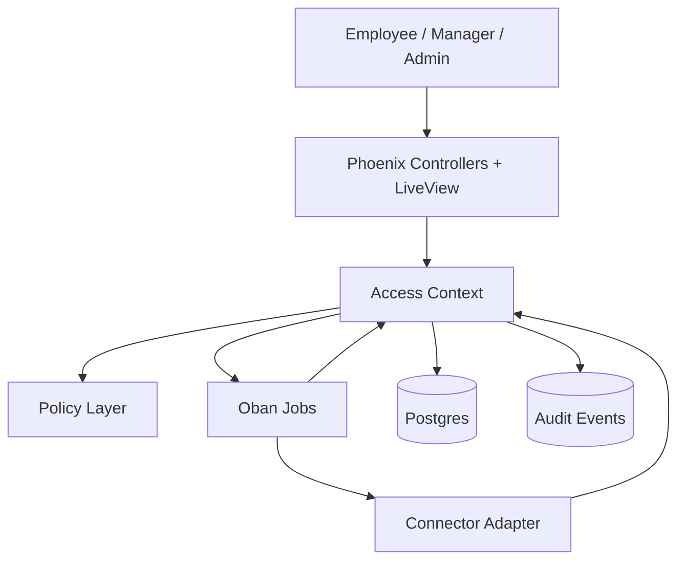
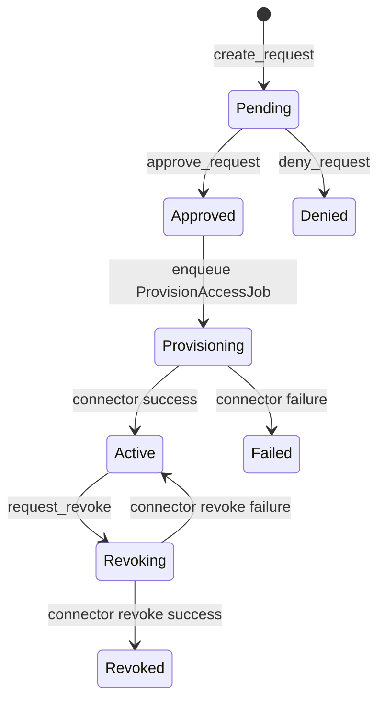

# OwlGate Architecture

This document provides a visual overview of core runtime boundaries and lifecycle transitions.

## System Context

```mermaid
flowchart TB
  User[Employee / Manager / Admin]
  UI[Phoenix Controllers + LiveView]
  Access[Access Context]
  Policy[Policy Layer]
  Jobs[Oban Jobs]
  Connector[Connector Adapter]
  DB[(Postgres)]
  Audit[(Audit Events)]

  User --> UI
  UI --> Access
  Access --> Policy
  Access --> DB
  Access --> Audit
  Access --> Jobs
  Jobs --> Connector
  Jobs --> Access
  Connector --> Access
```

## Request/Grant State Flow

```mermaid
stateDiagram-v2
  [*] --> Pending: create_request
  Pending --> Approved: approve_request
  Pending --> Denied: deny_request
  Approved --> Provisioning: enqueue ProvisionAccessJob
  Provisioning --> Active: connector success
  Provisioning --> Failed: connector failure
  Active --> Revoking: request_revoke
  Revoking --> Revoked: connector revoke success
  Revoking --> Active: connector revoke failure
```

